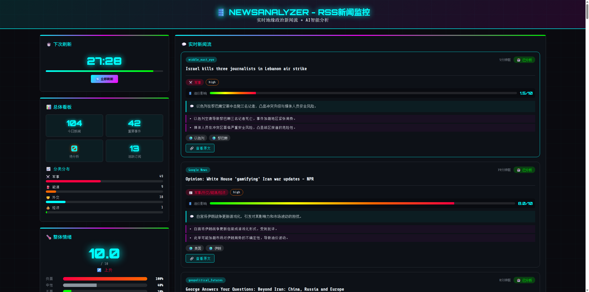

# NewsAnalyzer

[](https://opensource.org/licenses/MIT)
[](https://www.python.org/downloads/)

NewsAnalyzer 是一个基于AI的地缘政治新闻实时监控系统，专门用于监控和分析中东地区的地缘政治动态，评估其对全球能源市场的影响。

## 功能特性



- 🔍 **智能新闻收集**：自动从RSS源获取地缘政治新闻
- 🤖 **AI深度分析**：使用Ollama AI模型进行新闻分类、危机评分和趋势分析
- 🌐 **Web搜索增强**：AI分析时可自动搜索最新信息，提升分析准确性
- 📊 **实时监控看板**：赛博朋克风格的Web仪表盘，支持SSE实时推送
- 🌐 **中文支持**：自动翻译英文新闻为中文
- 📡 **RSS监控**：实时RSS新闻监控仪表盘
- 🎨 **主题管理**：支持自定义关键词主题，AI智能推荐关键词
- 🔄 **增量分析**：自动去重，只分析新增新闻

## 系统架构

```
NewsAnalyzer/
├── config/
│   ├── config.json              # 主配置文件
│   ├── config.json.example      # 配置示例
│   ├── dashboard_config.json    # 仪表盘配置
│   └── active_theme.json        # 主题配置
├── scripts/
│   ├── start_dashboard.py       # 启动入口（推荐）
│   ├── web_server.py            # Web服务器（Flask + SSE）
│   ├── rss_manager.py           # RSS新闻管理器
│   ├── news_fetcher.py          # 数据获取模块
│   ├── ollama_analyzer.py       # AI分析模块（支持Tool Calling）
│   ├── web_searcher.py          # Web搜索工具（DuckDuckGo）
│   ├── theme_manager.py         # 主题管理器
│   └── fix_date_format.py       # 日期格式修复工具
├── templates/
│   └── news_dashboard.html      # RSS监控界面
├── static/
│   ├── css/
│   │   └── dashboard.css        # 样式文件
│   └── js/
│       ├── theme-manager.js     # 主题管理前端
│       └── stats-manager.js     # 统计管理前端
├── data/                        # 数据目录（gitignore）
├── reports/                     # 报告目录（gitignore）
├── docs/
│   └── ollama_usage_report.md   # Ollama使用报告
├── tests/
│   ├── test_ollama_tool_calling.py
│   └── test_ollama_tool_calling_real.py
├── requirements.txt             # 依赖包
├── .gitignore                   # Git忽略文件
├── LICENSE                      # MIT许可证
└── README.md                    # 本文档
```

## 安装指南

### 前置要求

1. Python 3.8+
2. Ollama服务（本地或云端）

### 安装步骤

1. **克隆仓库**
```bash
git clone https://github.com/yourusername/NewsAnalyzer.git
cd NewsAnalyzer
```

2. **安装Python依赖**
```bash
pip install -r requirements.txt
```

3. **确保Ollama服务运行**

如果使用本地Ollama：
```bash
ollama serve
```

如果使用云端Ollama，请在配置中指定正确的模型名称。

## 使用方法

### 🌟 启动实时监控看板

这是**推荐的运行方式**，提供实时监控界面和RSS新闻自动拉取：

```bash
python scripts/start_dashboard.py
```

访问地址：http://localhost:5000/rss

**功能包括**：
- 📊 实时威胁等级监控（0-10分）
- 📈 三维评估（军事、外交、能源）
- 💡 关键洞察展示
- 📡 RSS新闻自动拉取（默认每30分钟）
- 🔄 实时数据更新（SSE推送）
- 🎨 赛博朋克风格可视化界面

**工作流程**：
1. 启动后立即加载最新数据
2. 后台定时拉取RSS新闻
3. AI自动分析新新闻
4. 实时更新仪表盘数据

## 输出文件

运行后会生成以下文件：

1. **JSON数据**：
   - `data/last_analysis.json`：最新分析结果（用于Web界面）
   - `data/processed_urls.json`：已处理URL记录（用于增量分析）
   - `data/rss_news.db`：SQLite数据库（存储新闻和分析结果）

## 配置说明

### 主要配置项

```json
{
    "geopolitical_news": {
        "enabled": true,
        "update_interval_hours": 6,
        "max_articles": 30,
        "lookback_days": 3,
        "news_sources": {
            "rss_enabled": true,
            "newsapi_enabled": true,
            "rss_feeds": {
                "reuters_world": "https://feeds.reuters.com/Reuters/worldNews",
                "bbc_middle_east": "http://feeds.bbci.co.uk/news/world/middle_east/rss.xml"
            }
        },
        "ollama_classification": {
            "enabled": true,
            "model": "gpt-oss:20b-cloud",
            "batch_size": 15
        }
    },
    "ollama_settings": {
        "analysis_model": {
            "name": "glm-4.6:cloud",
            "temperature": 0.3,
            "purpose": "深度分析、危机评估",
            "enable_search": true
        },
        "translation_model": {
            "name": "gpt-oss:20b-cloud",
            "temperature": 0.3,
            "purpose": "快速翻译、文本处理",
            "enable_search": false
        },
        "summary_model": {
            "name": "glm-4.6:cloud",
            "temperature": 0.3,
            "purpose": "趋势总结、综合评估",
            "enable_search": false
        },
        "web_search": {
            "enabled": true,
            "max_results": 5
        }
    },
    "rss_panel": {
        "fetch_interval_minutes": 30
    }
}
```

### RSS新闻源

系统默认配置了多个RSS新闻源：
- Reuters World News
- BBC Middle East
- Al Jazeera
- Middle East Eye
- Oil Price
- Foreign Policy
- Google News（伊朗、霍尔木兹海峡、中东冲突）

您可以根据需要添加或修改RSS源。

## 分析维度

系统从三个维度评估地缘政治风险：

1. **军事冲突强度** (conflict_intensity)
   - 评估军事行动、战争、袭击等事件

2. **外交紧张程度** (diplomatic_tension)
   - 评估外交关系、制裁、谈判等事件

3. **原油危机程度** (oil_crisis)
   - 评估能源供应、油价波动、海峡通行等事件

## 危机评分说明

- **0-3分**：🟢 低风险
- **4-5分**：🟡 中等风险
- **6-7分**：🟠 高风险
- **8-10分**：🔴 极高风险

## 高级功能

### 🌐 Web搜索增强（Tool Calling）

系统支持在AI分析时自动搜索最新信息，提升分析准确性：

**工作原理**：
1. AI模型收到新闻内容后，判断是否需要搜索
2. 如需搜索，自动调用DuckDuckGo搜索工具
3. 将搜索结果整合到分析中，生成更准确的报告

**启用/禁用**：
```json
"web_search": {
    "enabled": true,  // 设置为false禁用
    "max_results": 5  // 搜索结果数量
}
```

**依赖安装**：
```bash
pip install duckduckgo-search
```

### 📡 RSS新闻监控

访问 `http://localhost:5000/rss` 进入RSS新闻监控仪表盘：

- 📊 新闻统计概览
- 📰 实时新闻列表
- 🔍 关键词主题管理
- ⚡ 一键手动拉取
- 🔄 自动定时拉取（默认30分钟）

### 🎨 关键词主题管理

在RSS仪表盘中可以创建和管理关键词主题：

- 📝 创建主题（如"中东冲突"、"油价波动"）
- 🤖 AI智能推荐相关关键词
- 📊 关键词匹配统计
- 🔄 主题启用/禁用

## 常见问题

### Q: Ollama模型如何选择？

A: 推荐使用 `gpt-oss:20b-cloud` 云端模型，或本地部署的 `llama2`、`mistral` 等模型。详细使用说明请参考 `docs/ollama_usage_report.md`。

### Q: 如何添加自定义RSS源？

A: 在 `config/config.json` 的 `geopolitical_news.news_sources.rss_feeds` 中添加新的RSS源，或在RSS仪表盘界面直接添加。

### Q: 如何修复数据库中的日期格式？

A: 运行日期格式修复工具：
```bash
python scripts/fix_date_format.py
```

### Q: 如何查看Ollama模型使用情况？

A: 查看详细报告：
```bash
cat docs/ollama_usage_report.md
```

## 许可证

本项目采用 MIT 许可证 - 详见 [LICENSE](LICENSE) 文件

## 贡献

欢迎提交Issue和Pull Request！

## 联系方式

如有问题或建议，请通过GitHub Issues联系我们。